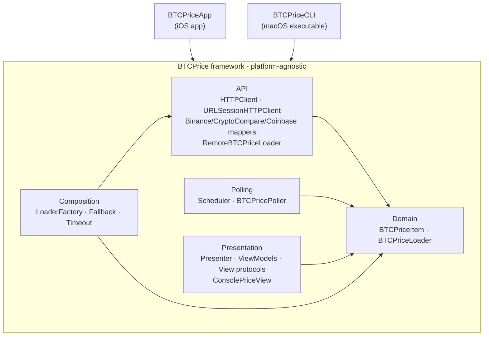
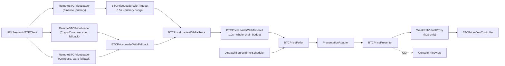

# Architecture

Two views of the system: **module dependencies** (build-time) and the **Composition Root assembly chain** (the runtime object graph the composers build).

## Module dependencies

The `BTCPrice` framework holds all platform-agnostic logic. Both apps depend on it and share the same domain, networking, polling, and presentation code — only the view layer is platform-specific. The framework imports no UIKit.

## Composition Root - assembly chain

`BTCPriceUIComposer` (iOS) and `BTCPriceCLIComposer` (CLI) build the same chain; only the final view differs (`BTCPriceViewController` vs `ConsolePriceView`).

**Read it as:** every second the scheduler fires the poller, which notifies `onStart` and then asks the loader chain for a price. Binance goes first with a **0.5s** budget of its own; if it fails or times out, CryptoCompare is tried, then Coinbase. The whole attempt is bounded by the spec's **1.0s** budget — the inner limit is what guarantees the fallbacks still have time to answer. The result flows through the adapter to the presenter, which formats it into platform-agnostic view models that the view (iOS labels or console output) renders. Tests swap real components for test doubles at every boundary (`HTTPClient`, `Scheduler`, the view protocols).
