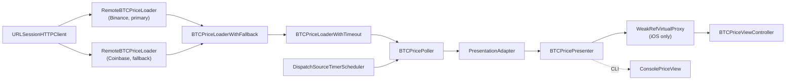

# Architecture

Two views of the system: **module dependencies** (build-time) and the **Composition Root assembly chain** (the runtime object graph the composers build).

## Module dependencies

The `BTCPrice` framework holds all platform-agnostic logic. Both apps depend on it and share the same domain, networking, polling, and presentation code — only the view layer is platform-specific.

```mermaid
graph TD
    App["BTCPriceApp<br/>(iOS app)"] --> FW
    CLI["BTCPriceCLI<br/>(macOS executable)"] --> FW

    subgraph FW["BTCPrice framework — platform-agnostic"]
        Domain["Domain<br/>BTCPriceItem · BTCPriceLoader"]
        API["API<br/>HTTPClient · URLSessionHTTPClient<br/>Binance/Coinbase mappers · RemoteBTCPriceLoader"]
        Polling["Polling<br/>Scheduler · BTCPricePoller"]
        Presentation["Presentation<br/>Presenter · ViewModels · View protocols · ConsolePriceView"]
        Composition["Composition<br/>LoaderFactory · Fallback · Timeout"]
    end

    API --> Domain
    Polling --> Domain
    Presentation --> Domain
    Composition --> API
    Composition --> Domain
```

## Composition Root — assembly chain

`BTCPriceUIComposer` (iOS) and `BTCPriceCLIComposer` (CLI) build the same chain; only the final view differs (`BTCPriceViewController` vs `ConsolePriceView`).

**Read it as:** every second the scheduler fires the poller → the poller asks the loader chain for a price (Binance first; Coinbase if Binance fails; the whole attempt is bounded by a 1-second timeout) → the result flows through the adapter to the presenter → the presenter formats it into view models → the view (iOS labels or console output) renders it. Tests swap real components for test doubles at every boundary (`HTTPClient`, `Scheduler`, the view protocols).
